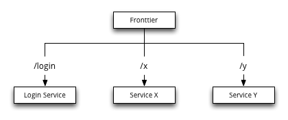
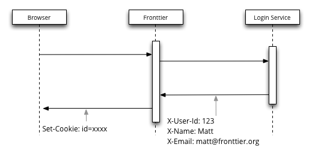
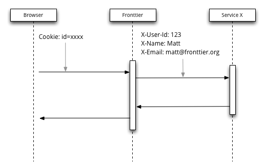
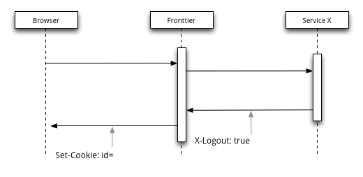
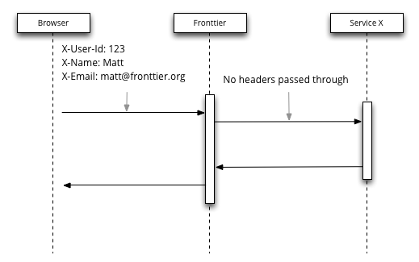

frontier
========

[](https://godoc.org/github.com/savaki/fronttier)

A routing reverse-proxy written in Go.

## Features

Fronttier is designed to be a front facing reverse-proxy.  Requests can be configured to route to different services e.g. google.com/mail, google.com/analytics, google.com/adwords, etc.

* routes requests to different services
* can be optionally configured to also manage user sessions 

### Service Routing

Let's start with a simple example.  

#### Example - Simple Routing

Suppose our site consists of three services as shown in the following diagram:



We could configure Fronttier as follows:

```
package main

import (
	"github.com/savaki/fronttier/proxy"
	"github.com/savaki/fronttier"
)

func main() {
	x, _ := proxy.Builder().Url("http://x-service").Build()
	y, _ := proxy.Builder().Url("http://y-service").Build()
	login, _ := proxy.Builder().Url("http://login-service").Build()

	builder := fronttier.Builder()

	builder.Paths("/x").Handler(x)
	builder.Paths("/y").Handler(y)
	builder.
		Paths("/login").
		Handler(login)

	server, _ := builder.Build()
	server.ListenAndServe(":8080")
}
```

### Session Management 

In addition to routing between sites, fronttier can also provide session management to those services.  Fronttier can be configured to do this by calling #SessionFactory on the path.  

#### Configuring:

1. Mark one or more routes with #SessionFactory
2. Optionally define one or more reserved headers.

#### Creating Sessions:

If a route marked with #SessionFactory returns a reserved header:

1. create a new session
2. place all the reserved headers and their values into the session
3. return to the user a cookie that identifies the session



#### Handling Requests:

Once a session has been created, if a request is received that contains a valid session cookie:

1. the reserved headers will be retrieved from the service
2. and added to the request when sent the underlying service



#### Logging Out:

To logout, any service may send the X-Logout header:

1. delete the session from the session store
2. clear the cookie



#### Protecting Against Forgery:

To defend against forgery, any reserved header received from the browser will be removed.  In the future, fronttier may include a signed header similar to how Amazon handles security.



## Sample Code

We can modify our previous example to this:

```
package main

import (
	"github.com/savaki/fronttier/proxy"
	"github.com/savaki/fronttier"
)

func main() {
	x, _ := proxy.Builder().Url("http://x-service").Build()
	y, _ := proxy.Builder().Url("http://y-service").Build()
	login, _ := proxy.Builder().Url("http://login-service").Build()

	builder := fronttier.Builder()

	builder.AuthConfig().ReservedHeaders("X-User-Id", "X-Name", "X-Email")

	builder.Paths("/x").Handler(x)
	builder.Paths("/y").Handler(y)
	builder.
		Paths("/login").
		Handler(login).
		SessionFactory() // #marks this route as capable of creating a session

	server, _ := builder.Build()
	server.ListenAndServe(":8080")
}
```


# Testing

Fronttier uses the very excellent [goconvey](https://github.com/smartystreets/goconvey) framework for testing.  To see all the tests execute in a browser:

```
go get github.com/smartystreets/goconvey
goconvey &
open http://localhost:8080
```
